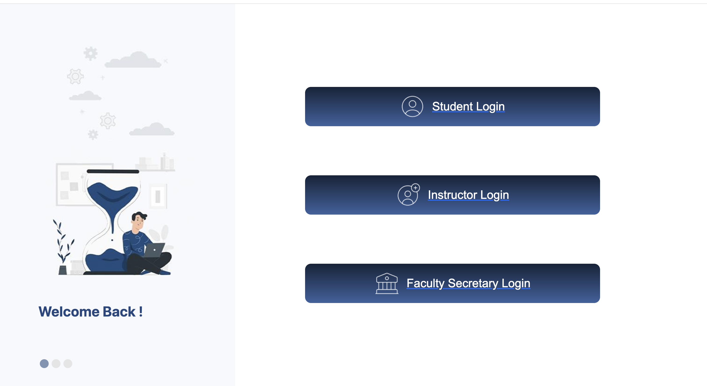

# University Resit Exam Management System

## Overview

University Resit Exam Management System is a full-stack web application designed to manage university resit exam operations.

The system provides separate interfaces and permissions for students, instructors, secretaries, and university administrators. It allows students to view grades and exam schedules, confirm resit exam participation, while instructors and administrators can manage grades, exam schedules, announcements, courses, and student records.

This project consists of an Angular frontend and a Laravel backend REST API.

---

## Project Structure

```text
university-resit-system/
│
├── frontend/      # Angular frontend application
├── backend/       # Laravel REST API backend
├── screenshots/   # Project screenshots
└── README.md
```

---

## Main Features

### Student Features

- Student login
- View enrolled courses
- View grades
- View grade details
- View exam schedule
- View resit exam information
- Confirm resit exam participation
- View course announcements and exam details

### Instructor Features

- Instructor login
- View assigned courses
- Manage grades
- Upload grades using Excel
- View students confirmed for resit exams
- Manage exam details and announcements
- View instructor exam schedule

### Secretary / Coordinator Features

- Secretary login
- Upload exam schedules using Excel
- View exam schedules
- Update exam schedule records
- Delete exam schedule records

### Admin Features

- Manage students
- Manage instructors
- Manage courses
- Manage users
- Manage academic records

---

## Technologies Used

### Frontend

- Angular
- TypeScript
- HTML
- CSS
- Bootstrap
- Angular Router
- Angular Guards
- HttpClient

### Backend

- Laravel
- PHP
- Laravel Sanctum
- RESTful APIs
- Eloquent ORM
- Laravel Migrations
- Middleware
- Maatwebsite Excel

### Database

- SQLite / MySQL

---

## Screenshots

### Login



### Student Dashboard


### Student Grades


### Exam Schedule


### Instructor Dashboard


### Upload Grades


---

## How to Run the Project

### Backend

```bash
cd backend
composer install
cp .env.example .env
php artisan key:generate
php artisan migrate
php artisan db:seed
php artisan serve
```

### Frontend

```bash
cd frontend
npm install
npm start
```

Frontend URL:

```text
http://localhost:4200
```

Backend API URL:

```text
http://127.0.0.1:8000
```

---

## Notes

- The backend must be running before using the frontend.
- The frontend communicates with the backend through REST APIs.
- The project supports role-based access depending on the logged-in user type.

---

## Future Improvements

- Improve UI/UX design
- Add notification system
- Add email reminders for resit exams
- Improve reporting and analytics
- Add PDF export for schedules and grades
- Add more advanced admin dashboard statistics

---

## Disclaimer

This project was developed as an academic full-stack web application for educational purposes.